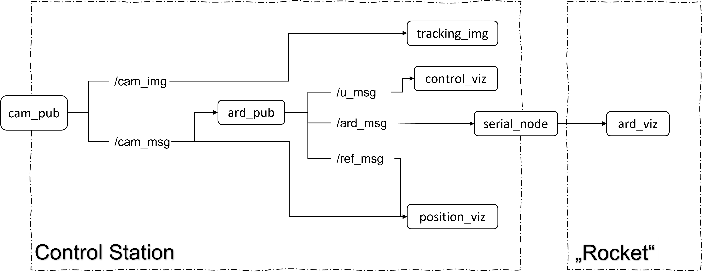

# Rocket_Tracking

The scope of this project is to make a closed control loop system in order to identify and locate a Rocket prior to the landing stage and guide it to the proper location.

## Implementation

The project makes use of the object detention algorithms developed in the _open CV_ and more specific [ArUco](https://docs.opencv.org/4.x/d5/dae/tutorial_aruco_detection.html) python libraries to locate the „Rocket“ through marker detection. The comunication between the different components of the system is given by ROS where the controls to be applied are displayed in a LCD display driven by an Arduino UNO board.

### Hardware description

The Rocket prototype as it was described is an Arduino UNO board that drives a LCD using the electrical scheme and programming described in:
[Liquid Crystal Displays (LCD) with Arduino](https://docs.arduino.cc/learn/electronics/lcd-displays)

It was printed an ArUco marker using the webpage:
[ArUco Marker Generator](https://chev.me/arucogen/),
choosing for this projet:

* Dictionary: 'Original ArUco'
* Marker ID: 58
* Size: 30 mm

### Software Architecture

* The data from the camera to the control station is given throught videostreaming and the data is published in the **/cam_img** topic for visualization in the **tracking_img** node.
* The data streamed is analysed in order to identify the presence of the specific ArUco marker where in the **cam_pub** node is made the triangulation of the marker to send the coordinates and published into **/cam_msg** topic as a x and y coordinates.
* In the **ard_pub** node is computed the controls, where the disered trajectory for landing is a straigth line between the initial position (first position identified by the **cam_pub** when the program is initialize) and the landing point given as a parameter. In this node is published the reference trajectory in the topic **ref_msg** and the calculated control (velocity in x and y) in the topics: **ard_msg** and **u_msg**.
* The **control_viz** and **position_viz** nodes are responsible for plotting the _control_ and _reference_ signal for visualization in the _Control Station_.
*The **serial_node** does the conversion of the data from the **/ard_msg** topic to serial format to be visualized in the onboard LCD screen of the „Rocket“ by the **ard_viz** node running in the Arduino UNO.
